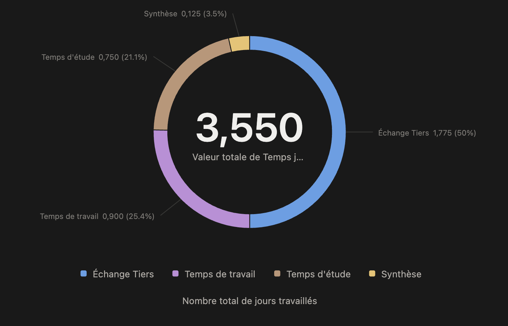

# Semaine 15 — Synthèse collective & premiers livrables

> Temps consommé à date : **à mettre à jour en fin de semaine**

<!-- DONUT : coller l'image donut-S15.png ici une fois le temps consolidé -->
<!--  -->

## Où en est-on ?

La **Phase A — Audit terrain** entre dans sa phase de consolidation. L'ensemble des entretiens individuels est terminé. Un atelier collectif a permis de confronter les constats et de valider les axes d'amélioration avec l'équipe.

## Ce qui a été fait

- **02/04** — Atelier collectif de partage avec 7 participants (équipe opérationnelle, sans la direction)
- **03/04** — Point d'avancement hebdomadaire avec la direction
- Consolidation de la carte des motivations (v3)
- Premiers schémas de processus (approche BPMN)

## Résumé de l'atelier collectif

L'atelier a réuni l'administration, le bureau d'études, l'atelier de fabrication, les conducteurs de travaux et la direction des opérations. L'objectif : confronter les constats et objectifs identifiés en entretien individuel.

**Consensus fort sur les besoins prioritaires :**

- **Visibilité planning** : aujourd'hui limitée à 2-3 mois, l'ensemble des fonctions a besoin d'une vision consolidée à 6-8 mois minimum
- **Suivi par ouvrage** : risque d'oubli d'éléments en souffrance entre les phases d'un chantier, faute de tableau de bord récapitulatif
- **Transmission de l'information** : les données existent (dans l'offre commerciale) mais ne circulent pas de façon structurée vers la production et les études
- **Rétro-planning automatisé** : alertes en cascade (prise de côte → plans d'exécution → visas → fabrication) déclenchées par les dates de pose

**Approche retenue :**

- Formaliser les processus avant de choisir l'outil
- Démarrer au niveau macro (lots), affiner progressivement jusqu'au repère
- Chaque poste saisit uniquement son information, l'outil déclenche les actions en cascade
- Démos éditeurs sur des scénarios concrets FL Métal (pas de démo générique)

## Point direction

- Validation de l'approche BPMN pour documenter les processus
- Décision : point hebdomadaire fixé le **vendredi 11h00**
- Début de la qualification des solutions prévu **fin avril**
- Fenêtre d'implémentation cible : **septembre 2026 – janvier 2027**

## Prochaines étapes

- Publication des résumés d'entretien et de la carte des motivations sur l'espace client
- Schémas BPMN macro des 3 processus principaux (avant-vente, exécution/études, production/pose)
- Préparation de la grille de qualification des solutions
- Session de travail mi-avril (en ligne), synthèse physique fin avril

## Documents disponibles